# 🔱 X-SOVEREIGN | ANDRE LAPENSÉE
### Sovereign Systems Architect • Quantitative AI & ML Engineer • Founder

  
  
  
  

---

## 🌌 Executive Overview

I am **Andre Lapensée** (operating as **X-Sovereign**). I engineer high-throughput financial prediction engines, autonomous multi-agent intelligence swarms, and sovereign computing infrastructure. 

My work bridges **mathematical finance** (Merton Jump-Diffusion, GARCH volatility clustering, multi-factor scoring), **agentic artificial intelligence** (heterogeneous swarms, autonomous self-healing execution, dynamic consensus), and **cloud-native full-stack systems** (FastAPI, Next.js 14, Supabase, Tailwind).

> *"We do not predict the future by guessing; we simulate 10,000 stochastic trajectories and architect the consensus."*

---

## 🏛 Flagship Sovereign Systems

| System | Focus Area | Architecture & Stack | Status |
| :--- | :--- | :--- | :---: |
| **🔱 [IPO-Brain Engine](https://github.com/signsafepro-create/ipo-brain)** | Institutional SEC S-1 Radar & Pre-IPO Valuation | **Python, FastAPI, NumPy, Next.js 14, Supabase** 10,000-path Merton Jump-Diffusion Monte Carlo engine, Edgar signal harvester, ARR velocity tracker | `PROD READY` |
| **⚡ Lil Jr 2.0 Autonomous Swarm** | Autonomous Multi-Agent Coordination OS | **Python, AsyncIO, PyTorch, Multi-LLM Router** 103-agent autonomous execution swarm, recursive error recovery, localized vector memory | `ACTIVE` |
| **📈 Sovereign Quant Pipeline** | Algorithmic Forecasting & Volatility Modeling | **Python, Scikit-learn, SciPy, GARCH, Bayesian Ridge** Walk-forward temporal cross-validation, synthetic regime generator, zero lookahead bias | `BENCHMARKED` |
| **🧊 AethelGrid Compute** | Physical Thermodynamic GPU Data Center | **Thermodynamic Loop, Hardware Topology** Captures 88% GPU heat dissipation into 6.2 MW clean energy, 1.167 PUE design | `BLUEPRINT` |
| **🛡 Sovereign Diligence Vault** | Institutional Diligence & Forensic Governance | **CRA SR&ED Ready, Cryptographic Audit Logs** Complete corporate data room, legal contracts, forensic milestone verification | `ENTERPRISE` |

---

## 🧠 System Architecture Blueprint

```mermaid
flowchart LR
    subgraph INGESTION ["📥 Multi-Source Ingestion Layer"]
        A1["SEC EDGAR S-1 Filings"]
        A2["Private Valuation Signals"]
        A3["Market Volatility / Macro Data"]
        A4["Agent Telemetry & Logs"]
    end

    subgraph ENGINE ["⚙ Sovereign Core Compute"]
        B1["Merton Jump-Diffusion<br/>Monte Carlo Engine (10k paths)"]
        B2["Multi-Factor ARR<br/>Scoring Algorithm"]
        B3["GARCH Volatility<br/>Clustering & Drift"]
    end

    subgraph SWARM ["🤖 Lil Jr 2.0 Agentic Swarm"]
        C1["X-Solver Consensus Engine"]
        C2["103 Autonomous Agents"]
        C3["Self-Healing Feedback Loop"]
    end

    subgraph OUTPUT ["🚀 Operational Interfaces"]
        D1["Holographic HUD Cockpit"]
        D2["Institutional REST API (FastAPI)"]
        D3["Pre-IPO Quant Trading Terminal"]
        D4["Next.js 14 Web4 Portal"]
    end

    INGESTION --> ENGINE
    ENGINE --> SWARM
    SWARM --> OUTPUT
```

---

## 📊 Live GitHub Telemetry & Activity

  

---

## 🛠 Weapons of Choice & Technical Arsenal

### 💻 Core Languages

### 🧠 AI, Quant & Scientific Computing

### 🌐 Frontend & Web4 Cockpit

### ☁ Infrastructure & Database

---

## 🎯 Current Operational Focus

- 📡 **Scaling IPO Brain 4.0**: Expanding real-time tracking across 20+ frontier AI and hyper-growth unicorn candidates (Databricks, OpenAI, Anthropic, Stripe).
- 🧬 **Autonomous Agent Synthesis**: Enhancing Lil Jr 2.0 multi-agent reasoning using dynamic self-reflection and multi-turn adversarial verification.
- ⚡ **Zero-Lookahead Temporal Modeling**: Refining out-of-fold temporal cross-validation on synthetic high-volatility financial datasets.
- 🤝 **Institutional Alliances**: Open to strategic technical partnerships, quantitative advisory, and high-impact systems architecture leadership.

---

## 📬 Connect & Direct Inquiries

| Channel | Contact Point | Purpose |
| :--- | :--- | :--- |
| 📧 **Primary Email** | [`signsafepro@gmail.com`](mailto:signsafepro@gmail.com) | Ventures, Institutional Inquiries & Architecture |
| 📬 **Secondary Email** | [`lil.jr2.0pro@gmail.com`](mailto:lil.jr2.0pro@gmail.com) | Autonomous Systems & Lil Jr AI Inquiries |
| 💼 **GitHub** | [`@signsafepro-create`](https://github.com/signsafepro-create) | Open Source Repositories & Code Contributions |
| 📍 **Base** | Canada (UTC-4 / EDT) | Available for Remote & Global Opportunities |

 

